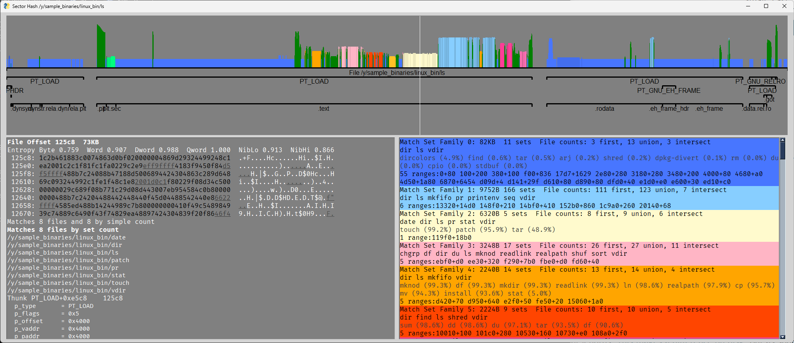
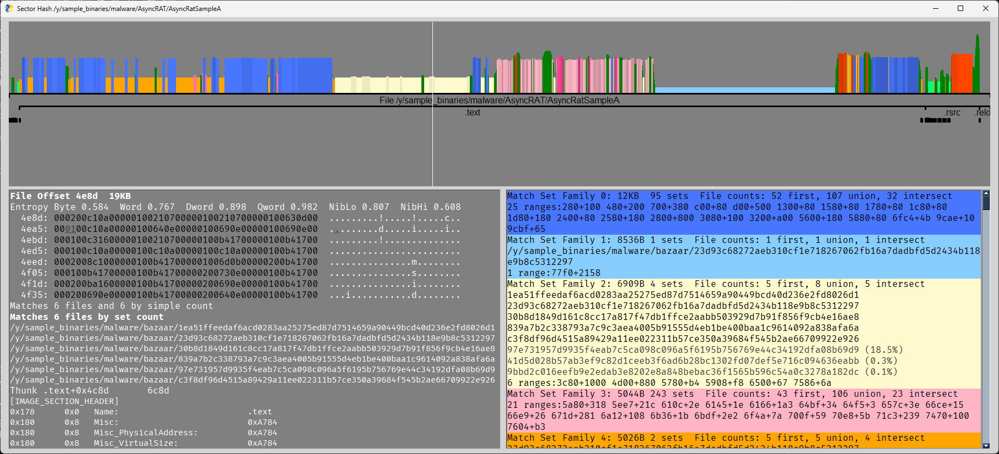

# REveal

REveal is framework to evaluate 1-to-N similarities in binaries using sector hashes.  The process of taking many 
binaries, storing their sector hashes in a database, and searching that database with sector hashes on a 
file-of-interest is called Match Set Analysis.

To see Match Set Analysis used with Data Flow Slices, see the related project 
[Flowslicer](https://github.com/praxiseng/flowslicer).


## Getting started

REveal uses Python 3.10 or newer, and dependencies can be installed with:

```
python -m pip install -r requirements.txt
```

## Create a Database

To ingest a list of files into a database:

```
py main.py ingest hash_db.sqlite S:\share\sample_binaries\linux_bin\
```

Note: The sample command was run from a Powershell prompt on a Windows box.  On Linux, substitute py with python3 and change the
path separator to "/".

Note: The above command will recursively enumerate all files in any specified folders, not just executables.


Sample output:
```
 4.84     92 files,   137947 hashes, 28517 hash/s  0.71  File:   46439 hashes S:\share\sample_binaries\linux_bin\cmake
 5.88    102 files,   187396 hashes, 31868 hash/s  0.70  File:   47620 hashes S:\share\sample_binaries\linux_bin\cpack
 7.00    109 files,   240438 hashes, 34361 hash/s  0.81  File:   55190 hashes S:\share\sample_binaries\linux_bin\ctest
11.61    158 files,   334313 hashes, 28784 hash/s  2.43  File:  312436 hashes S:\share\sample_binaries\linux_bin\emacs-gtk
14.62    216 files,   679111 hashes, 46444 hash/s  0.84  File:   65940 hashes S:\share\sample_binaries\linux_bin\gdb
22.14    362 files,   938023 hashes, 42364 hash/s  0.51  File:    6730 hashes S:\share\sample_binaries\linux_bin\lshw
29.77    504 files,  1166263 hashes, 39174 hash/s  0.62  File:   42895 hashes S:\share\sample_binaries\linux_bin\python3.8
31.79    509 files,  1260824 hashes, 39657 hash/s  1.29  File:  126849 hashes S:\share\sample_binaries\linux_bin\qemu-system-i386
33.14    510 files,  1387673 hashes, 41869 hash/s  1.35  File:  127150 hashes S:\share\sample_binaries\linux_bin\qemu-system-x86_64
40.37    651 files,  1604279 hashes, 39740 hash/s  1.81  File:  191997 hashes S:\share\sample_binaries\linux_bin\snap
52.99    900 files,  2165876 hashes, 40876 hash/s
 6.65  Finalizing ingest by sorting into final table
```

This output shows any operations that took over 0.5 seconds to process.

## Create a Search Database

A search compares a binary file against a hash database.  The search is performed in a search database, and all results
are stored in that search database.  That search database can then be queried and visualized.

The following command searches the `ls` binary against the `hash_db.sqlite` hash database, storing results in the 
`search_ls.sqlite` search database.

```
py main.py search .\hash_db.sqlite .\search_ls.sqlite S:\share\sample_binaries\linux_bin\ls
```

The search command starts by determining which sections of the file have sufficient entropy.  Then it performs a rolling
hash.  A rolling hash is a hash at every starting byte in the file for the length of the block size.  The `search`
command inserts these hashes into a table in the search database, then finds matches by attaching to the hash database
and performing a JOIN operation across tables.  The match results are then stored in another table for quick loading.


Use the `--show` command to launch the GUI at the end.

# Graphical Interface

To launch the GUI on a search database, run the `show` subcommand:

```
py main.py show search_ls.sqlite
```

REveal now has a graphical interface to display matches.  With the `ls` binary compared to 900 Linux binaries, we can
see how REveal can modularize parts of the binary based on match sets:



The GUI is broken up into three sections: top, bottom left, and bottom right.

## Top Section

The top section shows a visual representation of the bytes of the file
* The x axis is the byte offset within the file.
* The white line shows where the mouse is hovering, selecting a byte offset in the file to fill details in the lower
left pane.
* The ruler-like intervals show the location of various structures in the file
  * PE/ELF headers, segments, sections, resources, etc
* The colored graph describes matches
  * The y axis is the count of matching files on a logarithmic scale.
  * The colors describe _Match Families_
    * A _Match Set_ is a list of files that match at a particular offset
    * A Match Family is a group of similar match sets
    * The display shows different parts of the input file `ls` matching different sets of files. 

## Bottom Left Section

The bottom left section displays information about the selected byte offset
* The selected file offset, based on the mouse hovering on the top section
* Various entropy measures
  * All based on Shannon Entropy, normalized to a 0-to-1 scale
  * They all measure a 512-byte window starting at the cursor offset.
  * The Byte, Word, Dword, and Qword entropies measure the entropy of 1, 2, 4, and 8 byte values.
  * NibLo and NibHi measure the entropy of the low and high 4 bits of each byte respectively.
* Hex dump of the bytes.
  * Underlined bytes are affected by "zeroizing", where the bytes are zeroed before hashing.
* Matches by count.
  * This relates to a table that simply stores match count instead of storing the list of every file.
  * "Files by count" measures how many files in the database matched at that offset
  * "Hashes by count" measures how many times the hash was seen, including if seen multiple times in the same file.
  * These counts can be higher due to self-similar overlaps.
    * For example, if 0x10-0x90 matches 3 files and 0x20-0xa0 matches 5 more, there could be between 5 and 8 distinct 
      files between the two sets, yet this the count will report 8. 
* Matching files
  * A separate table stores the list of files by hash.
  * The name of each file is listed, up to a limit.
* Structure detail
  * Detailed information about the intervals and items at the specified offset

## Bottom Right Section

The bottom right section lists the Match Set Families
* 
* They are sorted by descending size
* There are 3 file counts:
  * The number of items in the first match set of this family.  The first match set has the largest number of bytes.
  * The union describes the list of all files seen in the family, regardless of how many bytes they match
  * The intersect describes how many files were seen in every match set in the family
* A short list of file names describes the list of files
* A second list of files that were not in every match set describes the percent of bytes they were included in.
* A list of ranges represented by the family.  The ranges are in `<length>+<size>` format.
* Hovering the mouse over the match set families lists the full path of the files.

# Malware Hunting

The REveal GUI can be used to analyze sections of malware.  To demonstrate this, we downloaded 1358 files from 
[Malware Bazaar](https://bazaar.abuse.ch/).  We then ingested those files into a sector hash database and searched a
sample of AsyncRAT.



The GUI shows several match set families.  Clearly, different parts of the binary have different matching power.
By hovering over the different sections, the hexdump will show some additional information:

* The pink sections appear to be a list of function names for imports
* The red sections match strings that are commands injected into the system, and an XML document (near the end of the file)
* The blue, orange, and yellow sections appear to be unusual, obfuscated code sequences.


# Feature Wishlist

* Strings analysis (using [Language-Aware Strings](https://osdn.net/projects/sfnet_la-strings/releases/))
* Fancy Tables
  * Cells should be able to summarize multiple lines of detail, and expand when hovered
  * For example, if files are indexed by hash, then they will have multiple names and paths from where they have been found
* Disassembly, decompilation
  * Use Ghidra or Binary Ninja to extract function ranges
  * Show disassembly and decompilation when hovering
* Flowslicer Integration
  * Have a separate analysis to extract data flow slices into a database
  * Display data flow slice information as a separate graph alongside the sector hash matches.
* Debug Symbol Information
  * If files in the match set have debug symbols, extract names and source code
  * Summarize names and source in the bottom view