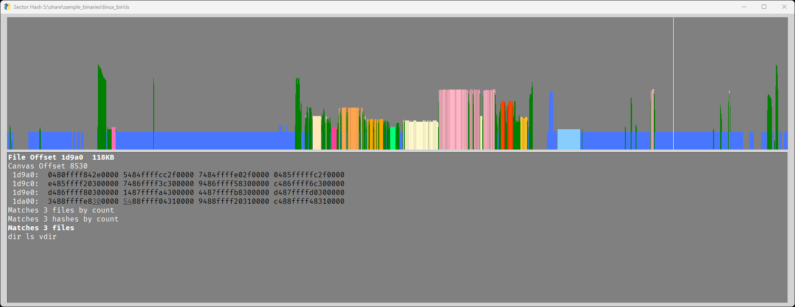

# REveal

REveal is framework to evaluate 1-to-N similarities in binaries using sector hashes.  The process of taking many 
binaries, storing their sector hashes in a database, and searching that database with sector hashes on a 
file-of-interest is called Match Set Analysis.

To see Match Set Analysis used with Data Flow Slices, see the related project 
[Flowslicer](https://github.com/praxiseng/flowslicer).


## Getting started

REveal uses Python 3.10 or newer, and dependencies can be installed with:

```
python -m pip install cbor2 pyelftools docopt pysimplegui intervaltree
```

## Create a Database

Note: The custom CBOR-based database format is deprecated and is being replaced with a SQLite format.

Note: The C++ version that works with the CBOR-based database is also being deprecated.


To ingest a list of files into a database:

```
py .\sql_db.py ingest hash_db.sqlite S:\share\sample_binaries\linux_bin\
```

Note: The sample command was run from a Powershell prompt on a Windows box.  On Linux, substitute py with python3 and change the
path separator to "/".

Note: The above command will recursively enumerate all files in any specified folders, not just executables.


Sample output:
```
 4.84     92 files,   137947 hashes, 28517 hash/s  0.71  File:   46439 hashes S:\share\sample_binaries\linux_bin\cmake
 5.88    102 files,   187396 hashes, 31868 hash/s  0.70  File:   47620 hashes S:\share\sample_binaries\linux_bin\cpack
 7.00    109 files,   240438 hashes, 34361 hash/s  0.81  File:   55190 hashes S:\share\sample_binaries\linux_bin\ctest
11.61    158 files,   334313 hashes, 28784 hash/s  2.43  File:  312436 hashes S:\share\sample_binaries\linux_bin\emacs-gtk
14.62    216 files,   679111 hashes, 46444 hash/s  0.84  File:   65940 hashes S:\share\sample_binaries\linux_bin\gdb
22.14    362 files,   938023 hashes, 42364 hash/s  0.51  File:    6730 hashes S:\share\sample_binaries\linux_bin\lshw
29.77    504 files,  1166263 hashes, 39174 hash/s  0.62  File:   42895 hashes S:\share\sample_binaries\linux_bin\python3.8
31.79    509 files,  1260824 hashes, 39657 hash/s  1.29  File:  126849 hashes S:\share\sample_binaries\linux_bin\qemu-system-i386
33.14    510 files,  1387673 hashes, 41869 hash/s  1.35  File:  127150 hashes S:\share\sample_binaries\linux_bin\qemu-system-x86_64
40.37    651 files,  1604279 hashes, 39740 hash/s  1.81  File:  191997 hashes S:\share\sample_binaries\linux_bin\snap
52.99    900 files,  2165876 hashes, 40876 hash/s
 6.65  Finalizing ingest by sorting into final table
```

This output shows any operations that took over 0.5 seconds to process.

## Search a Database

To search, you need to specify both the hash database and a search database.  The search database will store the rolling
hashes so that the search can use SQL join statements when attached to the hash database.

```
py .\sql_db.py search .\hash_db.sqlite search_ls.sqlite S:\share\sample_binaries\linux_bin\ls
```

The command will accumulate match lists for different file offsets, identify unique match sets, and launch the new
graphical interface to visualize the file matches.

# Graphical Interface

REveal now has a graphical interface to display matches.  With the `ls` binary compared to 900 Linux binaries, we can
see how REveal can modularize parts of the binary based on match sets:



The GUI is broken up into two sections.  The top section shows the match counts on a logarithmic scale.  The x axis is 
the byte offset within the file.  The white line shows where the mouse is hovering, selecting a byte offset in the file.
The colorization is based on match set analysis.  Sections matching the same set of files will have the same color.
Similar sets of files will have similar colors.

The bottom section displays information about the selected byte offset:
* File offset
* Hex dump of the bytes.
  * Underlined bytes are affected by "zeroizing", where the bytes are zeroed before hashing.
* Matches by count.
  * This relates to a table that simply stores match count instead of storing every hash.
  * "Files by count" measures how many files in the database matched at that offset
  * "Hashes by count" measures how many times the hash was seen, including if seen multiple times in the same file.
  * These counts can be higher due to self-similar overlaps.
    * For example, if 0x10-0x90 matches 3 files and 0x20-0xa0 matches 5 more, there could be between 5 and 8 distinct 
      files between the two sets, yet this the count will report 8. 
* Matching files
  * A separate table stores the list of files by hash.
  * In a future revision of REveal, high-count items will be pruned from this table
  * The name of each file is listed, up to the first 50.